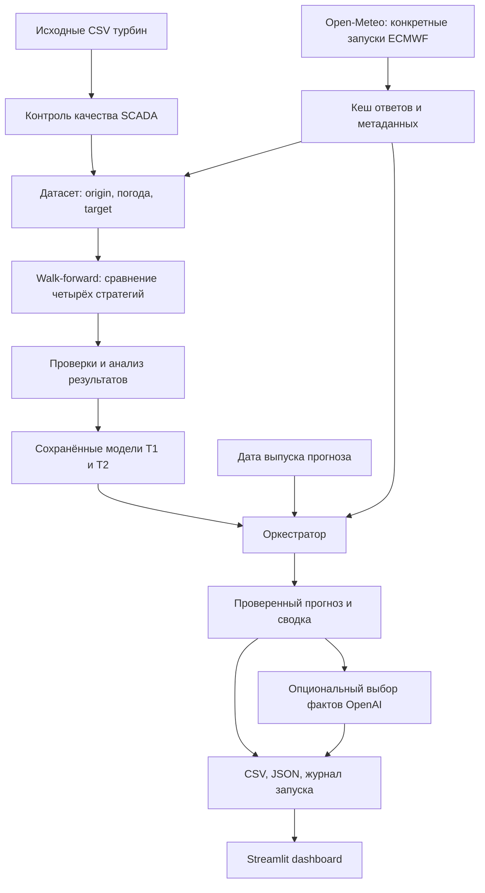

# WindAgent AI

**Прогноз нормализованной мощности двух ветровых турбин на 48 часов с проверкой временной доступности данных, журналом работы агента и интерактивным dashboard.**

Проект для HackAlem помогает оператору ветропарка или аналитику увидеть ожидаемую мощность, периоды роста и спада генерации и происхождение прогноза. На вход поступают история турбин из SCADA (системы сбора измерений оборудования) и архивные прогнозы погоды ECMWF; на выходе — почасовой прогноз, графики, CSV и журнал проверок.

Мощность представлена числом **от 0 до 1** относительно номинальной мощности турбины. Значение `0.7` означает 70% номинальной мощности. Расчёта энергии в кВт·ч или выручки в текущей версии нет.

## ⚠️ Важно: ветка проекта
Ветка main используется для документации проекта.
Рабочий код находится в отдельной ветке: <hackalem-ai>
После клонирования репозитория необходимо переключиться на неё:
```bash
git switch hackalem-ai
```
Проверить текущую ветку:
```bash
git branch 
```


## 1. Что реализовано

| Компонент | Возможности |
|---|---|
| Подготовка данных | Чтение двух исходных SCADA CSV, перевод времени в UTC, агрегация 10-минутных измерений в часы, контроль пропусков и дубликатов |
| Историческая погода | Получение конкретного запуска ECMWF через Open-Meteo Single Runs, фиксация модели, единиц, времени инициализации и предполагаемой доступности |
| Обучение | Четыре стратегии: эмпирическая кривая мощности, калибровка ветра с последующей кривой, HistGradientBoosting и гибридный CatBoost |
| Проверка качества | Последовательный backtest по датам выпуска прогнозов, MAE / RMSE / R², разрезы по турбинам, месяцам и горизонтам |
| Финальный прогноз | Сохранение моделей и прогнозирование по ежедневным origins с 31 января по 28 февраля 2026 года без дообучения на феврале |
| Агент | Последовательность инструментов с проверками, повторными запросами погоды, допустимым переходом к более старому запуску и журналированием |
| AI-анализ | Опциональный выбор значимых фактов через OpenAI; численные прогнозы рассчитываются Python-моделями |
| Dashboard | Выбор даты и турбины, графики мощности и погоды, показатели на 24/48 часов, история выполнения, сохранённый AI-анализ и сравнение моделей |
| Воспроизводимость | Кеш исходных погодных ответов, SHA-256, версии моделей, метаданные, отдельные файлы каждого запуска и повторное выполнение без сети |

## 2. Как работает решение

### Пользовательский сценарий

1. Пользователь открывает **WindAgent AI** и выбирает дату выпуска прогноза и турбину T1, T2 или обе.
2. В режиме **Cached Replay** приложение читает сохранённый прогноз и связанные с ним метаданные.
3. На вкладке **Generation & weather** отображаются мощность, погода, средняя прогнозная мощность за 24/48 часов и время пика.
4. На вкладке **Agent Execution & AI** можно проследить выполненные шаги, ошибки, выбранный запуск ECMWF и сохранённое объяснение.
5. **February Replay** показывает доступность результатов по датам, а **System & validation** — архитектуру, ограничения и метрики из файлов валидации.
6. При наличии моделей и погодного кеша кнопка **Run agent forecast** запускает новый расчёт для обеих турбин. Предыдущие результаты сохраняются. Фильтр турбины влияет только на отображение.

Чтение dashboard и переключение дат не вызывают погодный API или OpenAI. Новое AI-объяснение запускается отдельной кнопкой; обычный запуск агента из интерфейса выполняется без LLM.

### Что происходит внутри

Для выбранного `forecast_origin` система находит допустимый архивный запуск погоды, проверяет его, создаёт признаки и применяет сохранённую модель каждой турбины. После проверки 48 почасовых значений формируются сводка, CSV и журнал. Опциональный AI-анализ выполняется после численного расчёта и сохранения результата.

`Forecast origin` — момент, когда выпускается прогноз. `Valid time` — час, на который он рассчитан. Горизонт в коде: **O+1, O+2, …, O+48 часов**. Ежедневные origins задаются в `00:00 Asia/Almaty`; внутреннее время хранится в UTC.

## 3. Технологии

| Назначение | Используемые технологии |
|---|---|
| Язык | Python; локальная проверка выполнена на Python 3.12.2 |
| Работа с данными | pandas, NumPy, CSV; Parquet при наличии соответствующего движка |
| ML | scikit-learn / HistGradientBoostingRegressor, CatBoostRegressor, собственная эмпирическая кривая мощности |
| Сохранение моделей | joblib, JSON-манифесты, SHA-256 |
| Интерфейс | Streamlit, Plotly, настройки темы в `.streamlit/config.toml` |
| HTTP | requests |
| Погода | Open-Meteo Single Runs API, закреплённая модель `ecmwf_ifs` |
| Аналитический AI | OpenAI Responses API, модель по умолчанию `gpt-4.1-mini`, настраивается через `OPENAI_MODEL` |
| Конфигурация и тесты | python-dotenv, pytest, Streamlit AppTest |

Зависимости перечислены в [requirements.txt](requirements.txt). OpenAI вызывается через `requests`; отдельный OpenAI SDK проекту не требуется.

## 4. Архитектура



| Файл / каталог | Ответственность |
|---|---|
| [app.py](app.py) | Точка входа dashboard |
| `src/scada.py`, `src/gaps.py` | Загрузка SCADA, покрытие часов и работа с разрывами |
| `src/weather.py` | Получение архивной погоды, кеш, повторные запросы и выбор старого запуска |
| `src/leakage.py` | Проверки временных границ и доступности данных |
| `src/features.py`, `src/training_data.py` | Признаки и точное объединение погоды с targets |
| `src/models.py`, `src/development.py` | Модели, OOF-признаки, backtest, выбор и сохранение моделей |
| `src/evaluation.py`, `src/diagnostics.py` | Метрики и диагностические процедуры |
| `src/archive_audit.py` | Сверка обучающей погоды с исходным кешем |
| `src/forecasting.py` | Контекст прогноза, расчёт, проверки, сводки и экспорт |
| `src/agent.py`, `src/analysis_layer.py` | Оркестратор и опциональный AI-анализ |
| `src/dashboard.py`, `src/dashboard_data.py` | Интерфейс и чтение разрешённых полей артефактов |
| `src/dashboard_runtime.py` | Запуск агента из UI и загрузка перенесённых моделей по локальным путям |
| `src/cli.py` | Команды подготовки, проверки и прогнозирования |
| `tests/` | Тесты данных, временных правил, моделей, агента и интерфейса |

### Роль агента и OpenAI

Агент — один детерминированный оркестратор инструментов. При сетевых ошибках, HTTP 429 и 5xx погодный клиент делает до двух повторов с задержками 1 и 2 секунды. Если конкретный запуск недоступен, допускаются до двух более старых шестичасовых запусков той же модели. Неверные единицы, пропуски или нарушение временных правил приводят к отказу, а не к подмене данных наблюдениями.

OpenAI получает уже вычисленные факты и выбирает до шести их идентификаторов по строгой JSON-схеме. Текст собирает Python из этих фактов. LLM не вычисляет мощность, не меняет погодный запуск и не управляет проверками. При отказе OpenAI численный прогноз сохраняется, а ошибка отражается в журнале. Тексты интерфейса и AI-сводок в коде преимущественно на английском.

## 5. Данные, интеграции и защита от утечки

### История турбин

В корне находятся два исходных файла:

- `Dataset HackAlemAI для участников 11.03.2023-28.02.2026 - turbine 1.csv`;
- `Dataset HackAlemAI для участников 11.03.2023-28.02.2026 - turbine 2.csv`.

Они содержат ID, время, среднюю скорость ветра, нормализованную активную мощность и среднюю температуру. Исходные файлы читаются без изменения. Часовой target считается полным только при наличии шести уникальных измерений на минутах 00, 10, 20, 30, 40 и 50. Пропуски не интерполируются.

Координаты заданы в [src/config.py](src/config.py):

| Турбина | Широта | Долгота |
|---|---:|---:|
| T1 | 43.645150 | 78.535604 |
| T2 | 43.643198 | 78.538828 |

Временные метки SCADA не содержат часового пояса. По умолчанию применяется `Asia/Almaty` с историческими правилами, включая смену UTC+06 на UTC+05 в 2024 году. Повторяющийся час при переходе трактуется как более раннее вхождение. Это документированное допущение, а не подтверждение конвенции организаторов.

### Архивные прогнозы погоды

Клиент обращается к `https://single-runs-api.open-meteo.com/v1/forecast` с параметрами конкретного `run`, `models=ecmwf_ifs`, `timezone=UTC`, `timeformat=unixtime` и `wind_speed_unit=ms`.

Используются скорость ветра на 10/80/100/120 м, направление на 100 м, температура на 2 м и поверхностное давление. Высота 100 м — модельное приближение: реальная высота ступицы в конфигурации не известна.

Кеш сохраняет сырой ответ и JSON-метаданные: координаты, параметры запроса, время получения, запуск модели, предполагаемую доступность и SHA-256. Подстановка фактической погоды, реанализа или другой модели не предусмотрена.

### Временные правила

- Для погоды требуется `weather_run_init_utc + 7h <= forecast_origin_utc`. Семь часов — настраиваемое допущение о задержке публикации, а не измеренный исторический факт.
- `lead_time_hours` должен соответствовать разнице target и origin и находиться в диапазоне 1–48.
- Для обучения используются только более ранние origins и targets; час SCADA должен завершиться к моменту выпуска внешнего прогноза.
- Фактические ветер и мощность используются как labels и для диагностики, но не как будущие признаки при inference.
- Новый цикл обучения строит OOF-признаки отдельно для каждого origin: прогноз кривой для примера рассчитывается без обучения на его target и ещё неизвестных данных. Старые OOF-столбцы подготовки Phase 2A игнорируются.
- Подозрение на недоступность турбины исключает запись из обучения, но полные наблюдаемые часы с таким флагом остаются в основных метриках.
- Февральские targets запрещены в новом цикле разработки моделей. Февральский inference использует замороженную модель и новую допустимую архивную погоду.

## 6. Установка и быстрый запуск

Команды выполняются **из корня репозитория**. Для воспроизведения проверенного окружения используйте Python 3.12. Интернет нужен для установки пакетов и загрузки отсутствующей погоды; для просмотра готовых результатов ключи не требуются.

### macOS / Linux

```bash
python3 -m venv .venv
source .venv/bin/activate
python -m pip install -r requirements.txt
python -m pip check
python -m streamlit run app.py
```

### Windows PowerShell

```powershell
py -3.12 -m venv .venv
.\.venv\Scripts\Activate.ps1
python -m pip install -r requirements.txt
python -m pip check
python -m streamlit run app.py
```

Откройте адрес, напечатанный Streamlit, обычно **http://localhost:8501**. Остановка сервера — `Ctrl+C`. При отсутствии артефактов появится инструкция по их подготовке; это ожидаемое состояние новой копии проекта.

### Настройки окружения

Значения по умолчанию позволяют запустить интерфейс без `.env`. Для настройки скопируйте [.env.example](.env.example) в `.env`, если такого файла ещё нет. Не перезаписывайте существующие ключи. `.env` исключён из Git.

| Переменная | Значение по умолчанию / назначение |
|---|---|
| `SCADA_TIMESTAMP_MODE` | `civil_time`; также поддерживается явный `fixed_offset` |
| `SCADA_FIXED_UTC_OFFSET_HOURS` | Для режима `fixed_offset`; в примере — `5` |
| `FORECAST_ORIGIN_CONVENTION` | `almaty_midnight` |
| `WEATHER_AVAILABILITY_LAG_HOURS` | `7` |
| `OPENAI_API_KEY` | Необязательный ключ для нового AI-анализа |
| `OPENAI_MODEL` | `gpt-4.1-mini` |
| `OPEN_METEO_API_KEY` | Зарезервирован в примере, текущим публичным погодным клиентом не используется |

Изменение часовой политики или задержки требует повторной проверки методологии и моделей. Текущий код сохранения финального манифеста фиксирует `civil_time/Asia/Almaty` и задержку 7 часов; одной правки `.env` недостаточно для поддержки иной финальной конфигурации.

### Если команда передала готовые результаты

Скопируйте их с сохранением структуры:

```text
artifacts/
  predictions/
    february_rolling_forecast.csv
    runs/<run_id>/
      forecast.csv
      summary.json
      weather_provenance.json
      analysis.json                 # если AI-анализ выполнялся
  agent_runs/<run_id>.json
  metrics/model_comparison.csv
  models/
    model_selection.json
    final/
      manifest.json
      <model_version>/T1.joblib
      <model_version>/T2.joblib
data/cache/weather/                 # для нового расчёта без погодной сети
```

Для просмотра прогнозов нужны CSV; для истории агента и AI — соответствующие журналы и файлы конкретного запуска; для таблицы качества — метрики. Модели и погодный кеш нужны только для нового расчёта.

Dashboard умеет находить перенесённые модели в `models/final/<model_version>/` и проверяет их хеши. CLI загружает пути из манифеста, которые могут быть абсолютными путями другого компьютера. Для CLI используйте модели, созданные локальным `freeze-models`; для перенесённых моделей используйте предусмотренный адаптер dashboard.

## 7. Полное воспроизведение: от CSV до февральского прогноза

Этот путь нужен, если готовых результатов нет. Он требует сети для загрузки погоды; модели обучаются локально. Время выполнения зависит от API и компьютера. Команды подготовки и сравнения перезаписывают сводные артефакты соответствующего этапа.

### Шаг 1. Проверить окружение и исходные данные

```bash
python -m pytest -q
python -m src.cli prepare
python -m src.cli smoke
```

`prepare` показывает полные, частичные и пустые часы. `smoke` проверяет по две турбины на трёх датах. В этой диагностической команде origins заданы в **00:00 UTC**, тогда как основной цикл использует **00:00 Алматы**.

### Шаг 2. Подготовить историческую погоду и обучающий датасет

```bash
python -m src.cli phase2a-build
```

Диапазон по умолчанию: 1 октября 2025 — 29 января 2026, 121 origin. При полном успешном получении данных это **11 616 строк = 121 × 2 × 48**. Это ожидаемый размер по конфигурации, а не гарантия успешной загрузки API.

**Совместимость форматов:** `phase2a-build` предпочитает Parquet, если установлен движок; `phase2b-backtest` и сверка архива читают `forecast_training.csv`. После успешной сборки выполните конвертацию свежего Parquet, если он создан:

```bash
python -c "from pathlib import Path; import pandas as pd; p = Path('artifacts/datasets/forecast_training.parquet'); pd.read_parquet(p).to_csv(p.with_suffix('.csv'), index=False) if p.is_file() else None"
python -m src.archive_audit
```

Сверка сравнивает значения и временные метаданные обучающей погоды с кешем и проверяет хеши. Она не загружает замену отсутствующему кешу.

### Шаг 3. Сравнить модели

```bash
python -m src.cli phase2b-backtest
```

По умолчанию используются **60 ежедневных origins** с 1 декабря 2025 по 29 января 2026. На каждом origin каждая стратегия обучается заново на доступной к тому моменту истории, отдельно для T1 и T2:

| Код | Стратегия |
|---|---|
| `A_direct_curve` | Прогнозный ветер ECMWF на 100 м → эмпирическая кривая мощности |
| `B_calibrated_curve` | Погода → HistGradientBoosting для калибровки ветра → кривая мощности |
| `C_hist_gradient` | Погодные и календарные признаки → HistGradientBoosting для мощности |
| `D_hybrid_catboost` | Погодные признаки и OOF-прогноз кривой → CatBoost |

Основной критерий — MAE на полных наблюдаемых часах. При разнице до 0.002 предпочтение отдаётся более простой стратегии. Сохраняются также RMSE, R², смещение, ошибки по горизонтам и отдельное сравнение полностью наблюдаемых 48-часовых окон. Соседние прогнозы перекрываются; пары origin/target не являются независимыми наблюдениями.

Изучите:

- `artifacts/metrics/model_comparison.csv`;
- `artifacts/diagnostics/error_analysis.csv`;
- `artifacts/diagnostics/outer_fold_audit.csv`;
- `artifacts/models/model_selection.json`.

Короткий эксперимент допускается через `--start-date` и `--end-date`, но он перезаписывает артефакты сравнения. Одномесячный запуск не проходит проверку наличия обоих месяцев. Для итоговой поставки используйте полный диапазон по умолчанию.

### Шаг 4. Зафиксировать проверку и сохранить модели

После изучения результатов замените текст аргумента `--review` своим выводом о качестве и ограничениях:

```bash
python -m src.cli accept-validation --review "Ваш вывод по фактическим метрикам, ошибкам и ограничениям выбранной стратегии"
python -m src.cli freeze-models
```

`accept-validation` повторно запускает тесты, сверяет архив и проверяет временные границы, диапазон мощности, OOF и одинаковые выборки сравнения. `freeze-models` требует успешного прохождения этого этапа и неизменившегося датасета. Модели, версии пакетов, хеши и cutoff сохраняются в `artifacts/models/final/`.

### Шаг 5. Сформировать прогноз и журналы агента

```bash
python -m src.cli february-forecast
python -m src.cli agent-forecast --origin "2026-02-10 00:00" --turbines T1,T2 --cache-only --no-llm
python -m src.cli replay-february
python -m streamlit run app.py
```

`february-forecast` рассчитывает 29 origins с 31 января по 28 февраля, по 48 часов для двух турбин: при успехе **2 784 строки**. Последние горизонты выходят в март. Отдельный submission содержит только targets локального февраля; пересечения горизонтов сохраняются.

`agent-forecast` создаёт отдельный запуск и журнал. `replay-february` повторяет весь период через оркестратор **без сетевых запросов и LLM**, сохраняет отдельные результаты и проверяет точное совпадение мощности с каноническим февральским прогнозом. Нужны полный погодный кеш, локальные модели и исходный февральский экспорт.

### Опциональный новый AI-анализ

При заданном `OPENAI_API_KEY`:

```bash
python -m src.cli agent-forecast --origin "2026-02-10 00:00" --turbines T1,T2 --cache-only
```

`--cache-only` запрещает сеть только для погоды; OpenAI требует интернет и расходует API-кредиты. Чтобы гарантированно исключить AI-вызов, добавьте `--no-llm`. Для чтения уже сохранённого объяснения ключ не нужен. Журнал содержит статус, доступные идентификаторы ответа, задержку и расход токенов; отсутствующие сведения не оцениваются искусственно.

## 8. Как жюри проверить решение

### Базовая проверка новой копии

1. Установить зависимости по разделу 6.
2. Выполнить `python -m pytest -q` и `python -m src.cli prepare`.
3. Запустить `python -m streamlit run app.py`.
4. Убедиться, что интерфейс открывается; при отсутствии прогнозов отображается сообщение об отсутствующих артефактах, а не фиктивные графики.

**Подтверждённая локальная проверка 23.09.2026:** Python 3.12.2, **71 тест пройден**, `pip check` не обнаружил конфликтов зависимостей. Есть предупреждения NumPy о будущих изменениях обработки timedelta. Тесты покрывают временные нарушения, OOF, обработку ошибок API, корректность моделей, перенос моделей, чтение артефактов и поведение интерфейса через AppTest. Внешние ответы в тестах заменяются изолированными fixtures; это не доказательство качества реального февральского прогноза.

### Демо с реальными результатами

Предварительно получить комплект артефактов команды либо выполнить раздел 7.

1. В dashboard выбрать `2026-02-10 00:00` по Алматы и обе турбины.
2. Проверить 48-часовые графики, среднюю мощность на 24/48 часов и время пика. Переключить T1/T2.
3. Проверить происхождение погоды: инициализацию ECMWF, origin и предполагаемую доступность до origin.
4. Открыть **Agent Execution & AI** и сопоставить шаги с конкретным `run_id`. При отсутствии сохранённого AI-анализа приложение должно сообщить об этом.
5. Открыть **System & validation** и посмотреть сохранённое сравнение четырёх моделей. Убедиться, что это метрики backtest, а не обучения.
6. При наличии моделей и кеша выполнить **Run Agent Forecast → Run agent forecast**. Появится новый запуск; прежний останется в истории.
7. Для строгой проверки повторяемости выполнить `python -m src.cli replay-february`: команда должна подтвердить совпадение с каноническими прогнозами и отсутствие погодных сетевых запросов.

### Где проверять результат

| Артефакт | Содержание |
|---|---|
| `artifacts/predictions/february_rolling_forecast.csv` | Полные 48-часовые прогнозы, погодные признаки и происхождение |
| `artifacts/predictions/february_submission.csv` | Сокращённая таблица только с февральскими targets |
| `artifacts/predictions/runs/<run_id>/` | Прогноз, сводка, погодные метаданные и опциональный AI-анализ конкретного запуска |
| `artifacts/agent_runs/<run_id>.json` | Выполненные инструменты, статусы, предупреждения, ошибки и метаданные OpenAI |
| `artifacts/diagnostics/february_forecast_qc.json` | Контроль горизонтов, дат и диапазона мощности |
| `artifacts/diagnostics/february_replay_forecast_qc.json` | Результат повторного выполнения без сети |

Ключевые поля полного прогноза:

| Поле | Значение |
|---|---|
| `forecast_origin_utc`, `forecast_origin_local` | Момент выпуска в UTC и по Алматы |
| `valid_time_utc`, `valid_time_local` | Время target |
| `lead_time_hours` | Горизонт 1–48 часов |
| `turbine_id` | `T1` или `T2` |
| `predicted_power` | Прогноз в диапазоне [0, 1] |
| `weather_provider`, `weather_model` | Источник и погодная модель |
| `weather_run_init_utc`, `weather_available_at_utc` | Инициализация и предполагаемая доступность погоды |
| `model_name`, `model_version`, `run_id` | Стратегия, версия и идентификатор запуска |

Сокращённый submission содержит `turbine_id`, `forecast_origin_utc`, `valid_time_utc`, `lead_time_hours`, `predicted_power`, `model_name`, `run_id`. Для полного происхождения данных нужен rolling CSV. Операционные прогнозы не содержат вымышленных фактических `y_true`.

## 9. Подтверждённые результаты и комплектность

В проверенной локальной копии есть исходные CSV, код, тесты и результаты более ранней небольшой проверки: датасет на 17 origins / 1 632 строки и трёхдневный backtest. Эти локальные файлы игнорируются Git и **не заменяют полный цикл сравнения четырёх стратегий**.

На момент подготовки README в этой копии отсутствуют финальные модели, `artifacts/metrics/model_comparison.csv`, февральский экспорт и журналы агента. Поэтому здесь не приводятся неподтверждённые итоговые MAE/RMSE/R², победитель полного сравнения или утверждение об успешном полном февральском запуске. Их источником должны служить артефакты выполнения, перечисленные выше. Dashboard также читает метрики из файлов, а не из текста документации.

## 10. Ограничения текущей версии

- **Погодная доступность — допущение.** Задержка семь часов не подтверждает фактическую публикацию каждого исторического запуска. Запись времени и хеша обеспечивает проверяемость расчёта, но не доказывает доступность прогноза в прошлом сама по себе.
- **Не подтверждены часы SCADA и высота ступицы.** Сдвиг времени и различие между сеточной погодой ECMWF и измерениями у турбины влияют на качество.
- **Исторический сценарий ограничен конфигурацией.** Основной backtest рассчитан на декабрь 2025 — январь 2026, replay — на февраль 2026. Это не постоянно работающая интеграция с действующей SCADA и текущими прогнозами.
- **Нет оценки неопределённости и февральской точности в интерфейсе.** Доверительные интервалы не калибруются; inference не сравнивается с февральскими фактическими labels.
- **Нет планировщика.** Оркестратор выполняется по CLI или кнопке; фоновый сервис автоматического выпуска новых прогнозов не реализован.
- **Форматы требуют внимания.** После записи Parquet нужен CSV для обучения; компактный submission сохраняет перекрывающиеся прогнозы. Формат сдачи следует сверить с заданием организаторов.
- **Воспроизводимость зависит от артефактов.** Модели и кеш нужно передать отдельно или пересоздать. Требования пакетов заданы диапазонами, общего lock-файла нет; версии fitted-пакетов сохраняются с моделью.
- **CLI и перенос моделей.** CLI использует пути из сохранённого манифеста; dashboard имеет отдельный адаптер для перенесённых моделей.
- **Некоторые предупреждения сводки заданы статически.** В коде есть предупреждения о занижении высокой мощности и росте ошибки на дальнем горизонте. При новом выборе модели их нужно сверять с фактической валидацией, а не считать независимым доказательством качества.
- **Локальное приложение для демонстрации.** Авторизация пользователей, промышленное многопользовательское развёртывание, расчёт МВт·ч и финансовая оптимизация не реализованы.

## 11. Развёрнутая версия

**Публичная deployed-версия в репозитории не указана.** Подтверждённый способ запуска — локальный Streamlit:

```bash
python -m streamlit run app.py
```

Адрес `http://localhost:8501` относится к компьютеру, на котором запущен сервер, и не является публичной ссылкой на проект.
